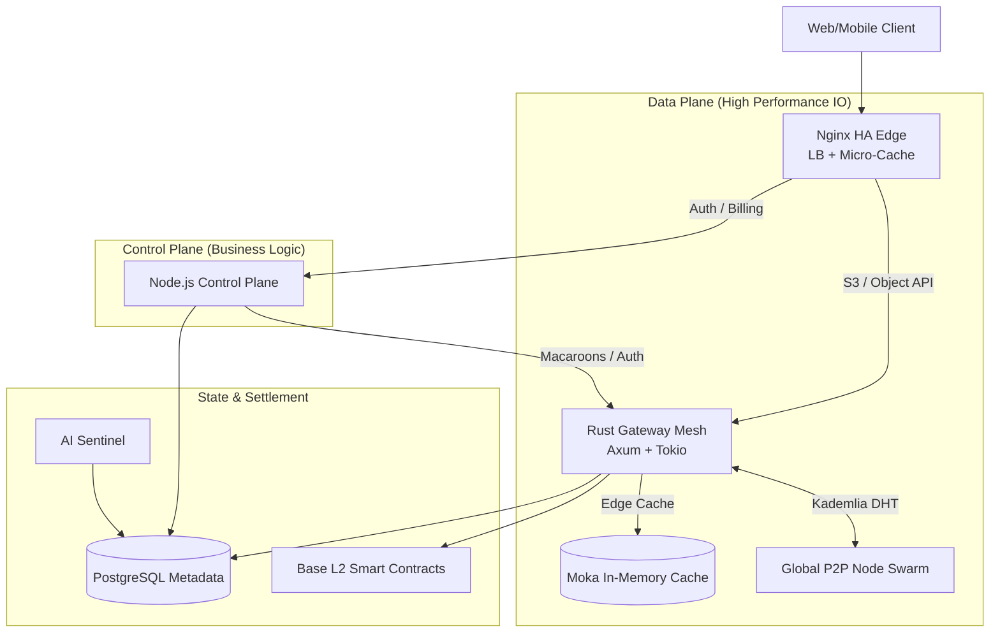

# NeuroStore High-Performance Architecture

NeuroStore employs a state-of-the-art **Hybrid Edge Architecture** designed specifically to separate the *data plane* (heavy IO) from the *control plane* (business logic), achieving multi-gigabit throughput while maintaining zero-knowledge encryption.

---

## 🏗 Component Topology

---

## ⚡ Architecture Deep Dive

### 1. Nginx: The "Thundering Herd" Shield
The immediate entry point is Nginx configured with **Least-Connection Load Balancing**. 
- **Micro-Caching**: We utilize `proxy_cache` with `proxy_cache_lock`. If 10,000 users request the same viral video object simultaneously, Nginx only passes *one* request to the Rust Gateway and caches the response for 60 seconds. The other 9,999 requests are served directly from Nginx RAM/Disk within 1-2 milliseconds.
- **Differentiated Rate Limiting**: Authentication endpoints are hard-capped to prevent brute forcing (`5 req/s`), while data streaming endpoints are given massive burst allowances (`50 req/s`) and chunked body transmission (`proxy_request_buffering off`).

### 2. Rust Gateway: The Async Data Plane
The Gateway is written in Rust, leveraging `axum` and `tokio` for massively parallel I/O.
- **Zero-Block Design**: All incoming object uploads are immediately piped through AES-256-GCM encryption streams and Reed-Solomon Erasure Coding *simultaneously*, before being multiplexed out to the P2P Swarm. Memory copies are avoided wherever possible.
- **Moka LRU Edge Cache**: Hot objects that bypass the 60-second Nginx cache are still caught by an ultra-fast concurrent local LRU cache (`moka`), preventing repetitive P2P fetching.

### 3. LibP2P Swarm: The Decentralized Mesh
By utilizing LibP2P's Kademlia DHT, physical storage nodes communicate seamlessly across NATs using AutoNAT and Circuit Relays.
- **Erasure Coding (10/30)**: Files are split into 30 shards, where any 10 can rebuild the file. This creates **11 nines (99.999999999%) of durability** without the traditional Web2 bottleneck of 3x full-file duplication.

### 4. Smart Contracts: Trustless Settlement
To ensure nodes do not suffer from Web2 database limitations, payments and slashing stakes are settled directly on the **Base L2 Ethereum Network**.
- A `StoragePayments` contract requires a minimum stake of `10 NEURO per GB`.
- Node operators submit ZK Proof of Spacetime (PoSt), and if they drop shards, their collateral is slashed dynamically with a 24-hour timelock dispute window.

### 5. Repair Daemon: Autonomous Self-Healing
While the user sleeps, the Gateway's background processes actively secure the network:
- **Proactive Migration**: Queries the AI Sentinel for nodes with `churn_probability > 0.8`. If a node is likely to shut off, the daemon pulls the shards and re-pins them to high-reputation nodes *before* the offline event occurs.
- **Shadow Manifests**: The SQL database is only an index; every object mapped is replicated back into the global swarm as a hidden metadata JSON file. Even if the Postgres DB is destroyed, the network can be reconstructed from the Swarm.
